## Introduction

+ Humans make on average 1-4 saccades every second
    - thats 10s to 100s of thousands of saccades per day
    - how many are deliberately planned?
    
+ Humans feel like they can VOLUNTARILY move their eyes:
    - to any location
    - at any time
    
+ Certain circumstances seem to produce INVOLUNTARY saccades
    - involuntary saccades contradict top-down goals
    - e.g. the sudden onset of the cue in the antisaccade task

---

## The antisaccade task

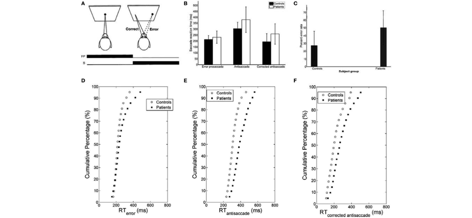

Cutsuridis, V., Kumari, V., & Ettinger, U. (2014). Antisaccade performance in schizophrenia: A neural model of decision making in the superior colliculus. Frontiers in Neuroscience, 8(8 FEB), 1–13.

---

## Overview

#### Purpose

+ To better understand the top-down control mechanisms involved with eye movement control and how they interact with bottom-up control mechanisms

#### How

+ Compare new computational model to healthy subjects
    - Meeter's competitive integration in SC plus automatic saccade timing
    - competitive integration guided by braver's DMC framework

#### Main results

+ For the most part, both bottom-up and top-down control only affect the spatial compoent of saccade programming
+ No direct top-down control over when the eyes move, only where
+ The ability to change a bottom-up/top-down bias may explain individual and task related variations in performance

---

## Short intersaccadic intervals

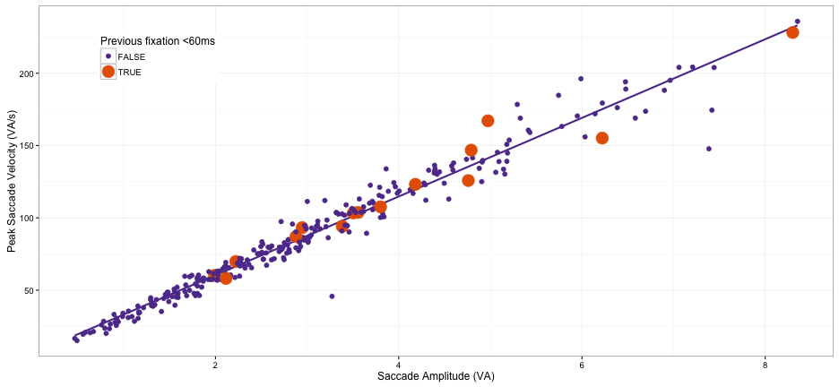

---

## Overlapping saccades and glissades

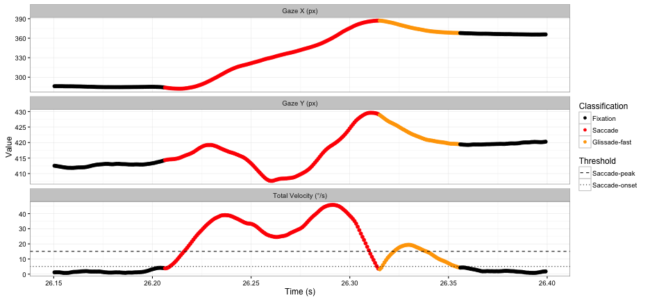

---

## Fixational eye movements (microsaccades)

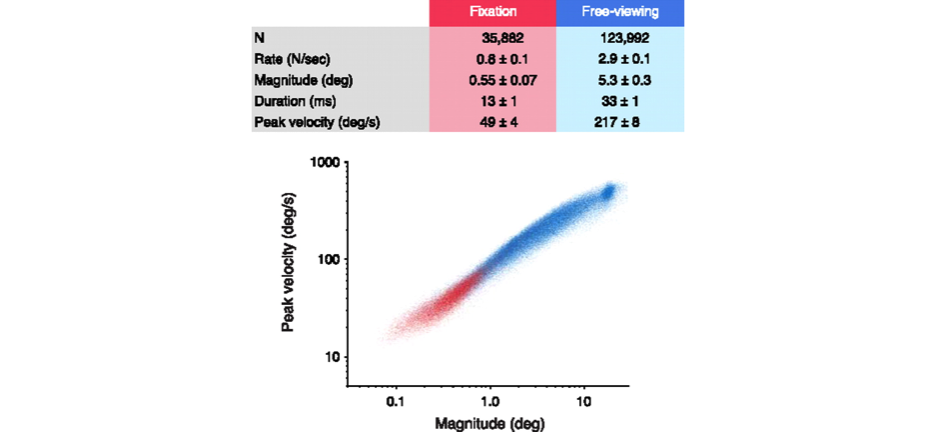

Martinez-Conde, S., Macknik, S. L., Troncoso, X. G., & Hubel, D. H. (2009). Microsaccades: a neurophysiological analysis. Trends in Neurosciences, 32(9), 463–475.

---

## Evidence supporting automatic saccade timing

+ corrective eye movements (aka glissades)
    - short intersaccadic intervals
    - no intersaccadic interval
    - overlapping saccades

+ fixational eye movements (aka microsaccades)
    - reduce image fading from photoreceptor fatigue
    - possibly related to shifts of attention
    - follows main-sequence

+ smooth pursuit
    - lots of small regularly spaced unconscious saccades

--- .segue .dark .quote

<ss>How does the sense of voluntary control emerge from an oculomotor control system based on automatic saccade timing?</ss>

--- .segue .dark .quote

## The Experiment

--- &twocol

## Mixed-block antisaccade task

*** =left 

+ 23 subjects
+ 480 trials split by 12 blocks
    - 20 anti / 20 pro per block
    - Dropped all trials with blinks between fixation point offset
    and first saccade
+ No specific instructions to prioritize saccade accuracy
    - Subjects most likely though secondary task was primary task

*** =right

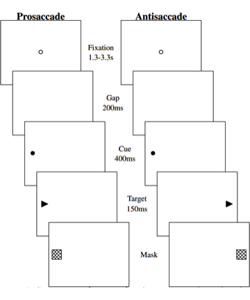

---

## Saccade response accuracy

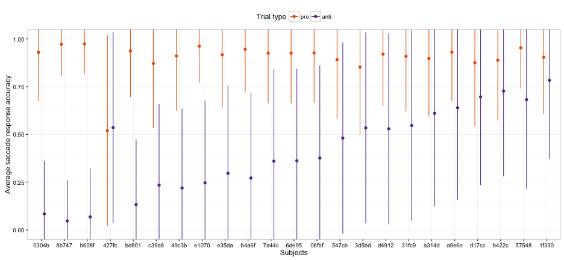

---

## Saccade latency

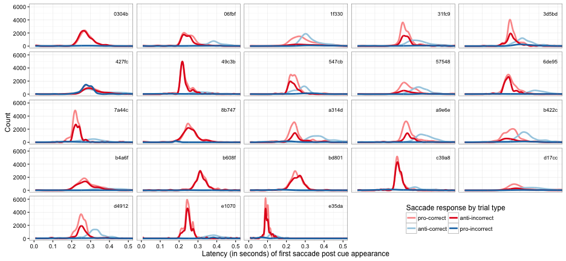

---

## Saccade amplitude

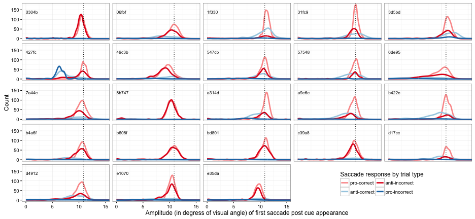

---

## Main sequence

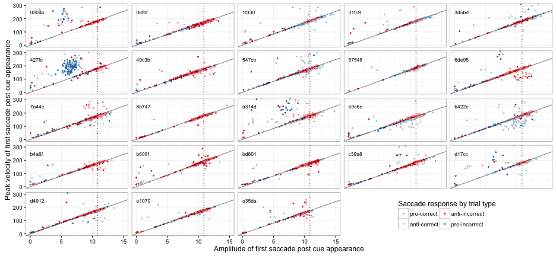

--- .segue .dark .quote

## Models \& Simulations

---

## The (C)ontrolled (R)andom-walk with (I)nhibition for (S)accade (P)lanning model

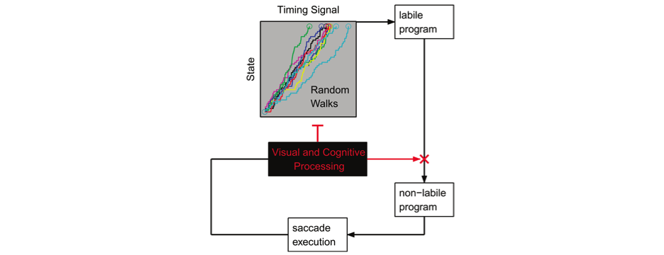

Nuthmann, A., Smith, T. J., Engbert, R., & Henderson, J. M. (2010). CRISP: a computational model of fixation durations in scene viewing. Psychological Review, 117(2), 382–405.

---

## CRISP control mechanisms

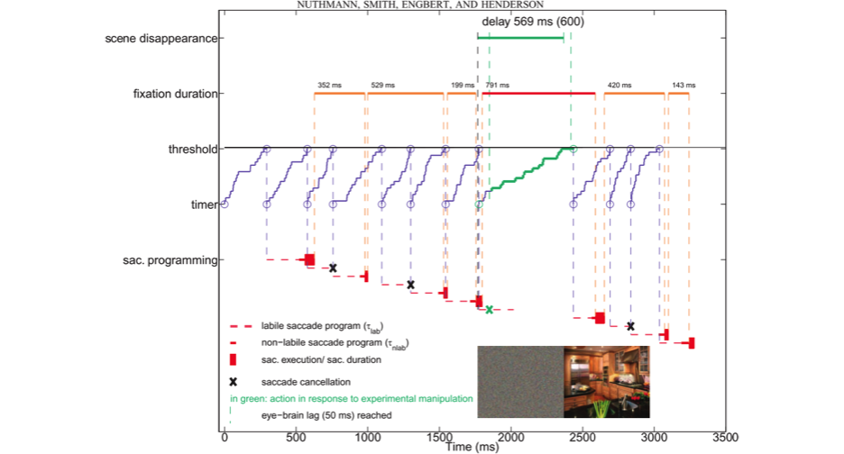

---

## CRISP DEVS (Discrete Event System Specification)

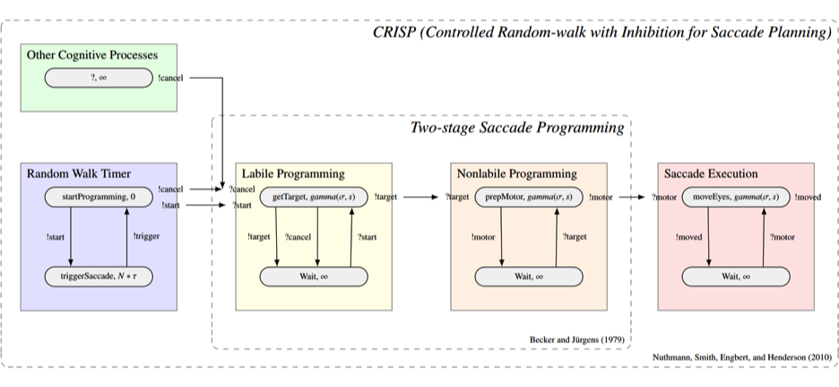

https://github.com/RyanHope/PyeMovements/blob/master/crisp.py

https://simpy.readthedocs.org/en/latest

---

## Attention Biased Saliency (ABS)-CRISP

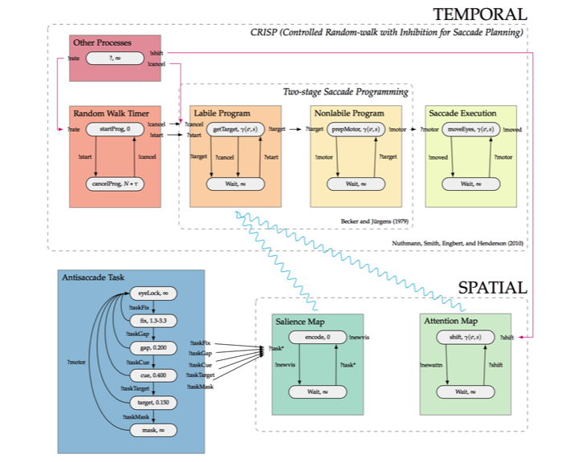

## The Models

---
    
## Model variant conceptual differences

+ For the CRISP model, fixating is achieved via saccade cancellation.

+ For the ABS-CRISP, fixating is achieved via making a saccade of zero amplitude.

--- &twocol

## Model antisaccade task interaction

*** =left

CRISP:
+ possible cancellation at gap
+ possible cancellation at cue
+ rate change at gap
+ rate change at cue
+ getTarget() always returns Inf

*** =right

ABS-CRISP:
+ attention shift triggered at gap
+ attention shift triggered at cue
+ rate change at gap
+ rate change at cue
+ getTarget() weighted sum of saliency and attention map
    - $$latex
    TM =  (\alpha) * AM + (1-\alpha) * SM
    $$
    - AM and SM single floating point value (-Inf,Inf) centered at 0
    - indicates horizontal position relative to fixation point

--- .segue .dark .quote

## Model fitting/evaluation procedure

--- &twocol

## Model parameters

*** =left

CRISP:
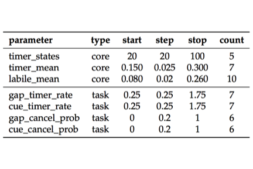
617,400 combinations

*** =right

ABS-CRISP:
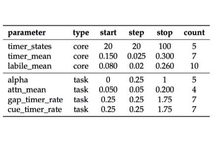
343,000 combinations

---

## MindModeling@Home (Beta)

MindModeling@Home is volunteer computing pool dedicated to the advancement of cognitive science.

+ Based in Dayton, OH at:
    - The University of Dayton Research Institute
    - Wright State University
+ https://mindmodeling.org/
+ **Can run a year's worth of simulations in the matter of a few hours to a few days!**

Powered by:

---

## Parameter space evaluation

"model run" = 500 trials

KS test = Kolmogorov–Smirnov test

+ One model run per parameter combination was dispatched out to volunteer computers
+ For each model run:
    - the resulting latency distribution (from the model) was compared to each of the 23 subjects data using a two-sample KS test
    - the two-sample KS test scores from each subject (as well as the evaluated parameter values) were returned to the MindModeling servers

---

## "good fitting models""

--- .segue .dark .quote

## Simulation 1

---

## Sim1 saccade latency (prosaccade trials)

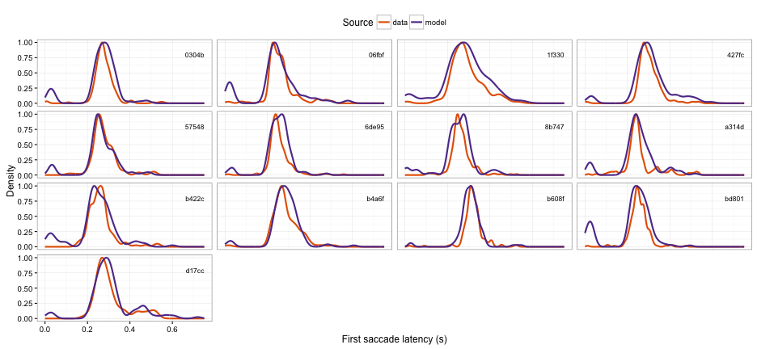

---

## Sim1 saccade latency (antisaccade trials)

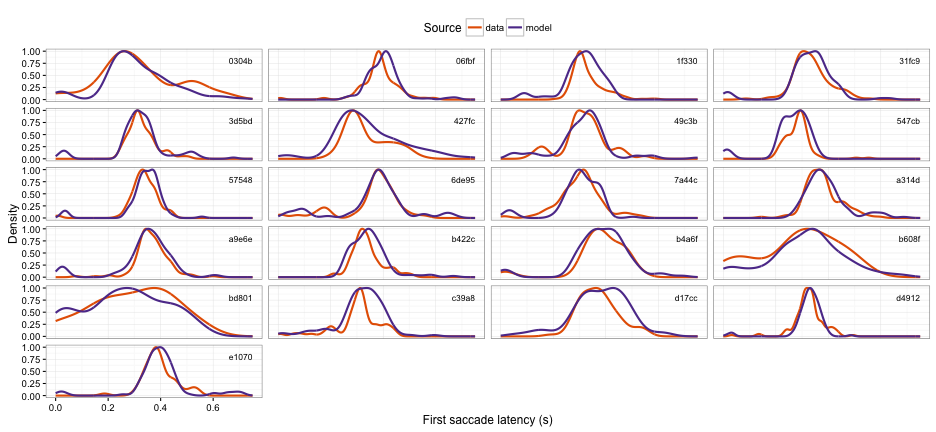

---

## Sim1 cluster analysis

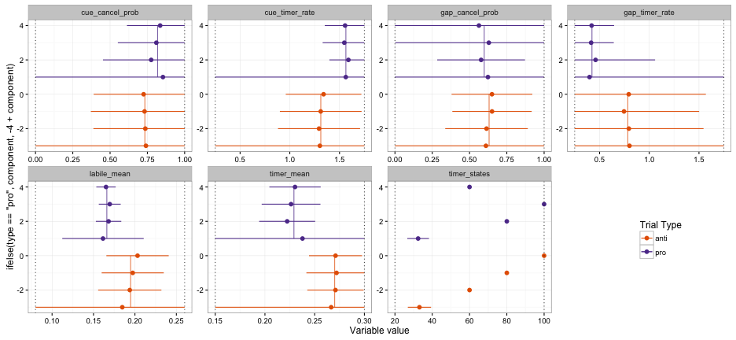

--- .segue .dark .quote

## Simulation 2

---

## Sim2 saccade response accuracy

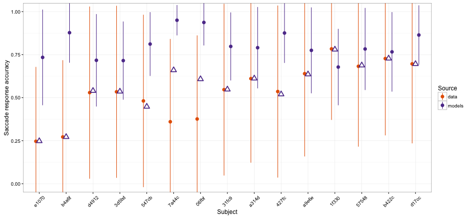

---

## Sim2 saccade latency (prosaccade trials)

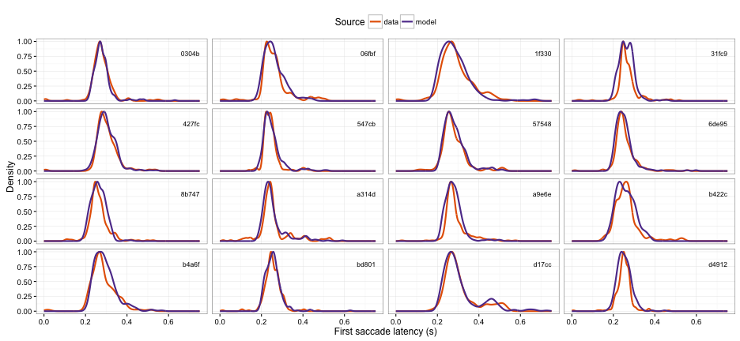

---

## Sim2 saccade latency (antisaccade trials)

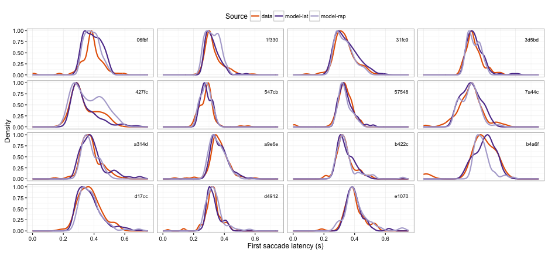

---

## Sim2 cluster analysis

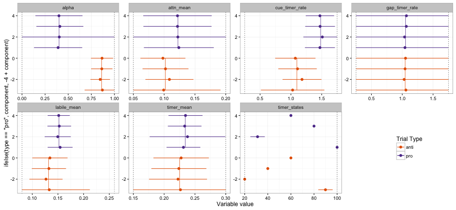

--- .segue .dark .quote

## Conclusions

---

## Results

+ Further support of the idea that saccades are triggered automatically and rhythmically
    - Shifts of attention don't directly trigger saccade programming
    - No direct top-down control over when the eyes move
    - Competitive integration of bottom-up and top-down spatial control signals in the SC
    provides most control
    - Fixating is making really just making very tiny saccades
+ The default mode of the SC is to be biased towards bottom-up information
    - What ever is involved with shifting the bias towards top-down also seems to attenuate other bottom-up effects
    - Individual differences seem to be related to the ability to shift the bias
+ While shifing bias towards town-down is needed to over coming strong bottom-up signal, shifting bias towards bottom-up might be need to make covert attention shifts without producing eye movements

---    

## Limitations

+ No mechanism for what shifts the bias
    - Could be related to "focusing" attention
    - Might be yolked to shifts of attention
    
+ Amplitude predictions were horrible
    - ABS-CRISP did produce partial amplitude saccades which is improvement over Meeter model
    - SC likely takes multiple samples from the TM during the duration of the labile program

+ Assumed bottom-up and top-down signals had equal relative strengths and static over time

--- .segue .dark .quote

## Any questions?

### Thank you for your time!
